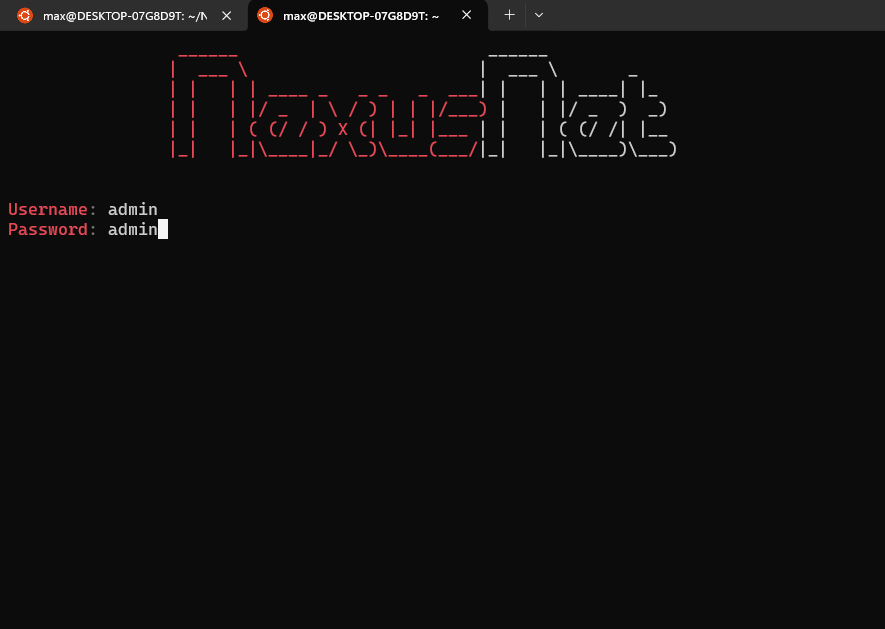
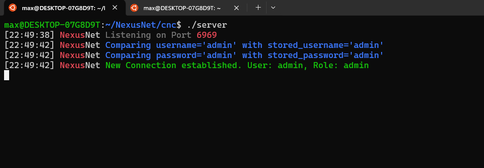
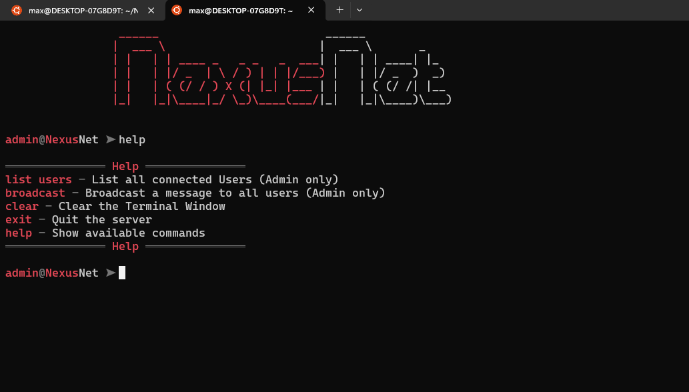

# C-TCP-Server
I created a tcp server in c with command implementation, user authentication and permission based roles.

## How to Setup:
```bash
git clone https://github.com/maxi-schaefer/C-TCP-Server.git
cd ./C-TCP-Server
make
./server
```

## How to Connect:
```bash
telnet localhost 6969
```

## Screenshots



